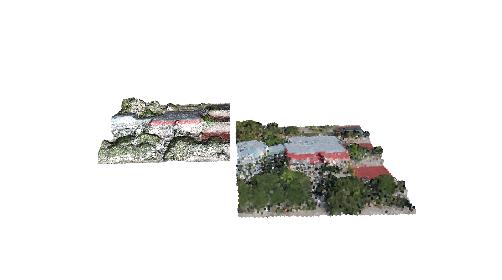

# Points2Minecraft
A simple tools to voxelize point cloud and add it to Minecraft

This is a tiny project that I've done during MAI Math Modeling School to get familiar with 3D data processing.

You can voxelize you .las files with voxelize.py and then add them to your Minecraft map with add2mc.py.

The map from colors to Minecraft block is done using idea from [here](https://projects.raspberrypi.org/en/projects/minecraft-selfies/5)

For minecraft level modification I used pymclevel which only supports python2. That is the reason for 2 requirements files.
voxelize.py runs on python3, add2mc runs on python2.


## Pretty Images
Examples of voxelizations using open3d API of school campus point cloud.



Video result in Minecraft: https://youtu.be/6mpioX92Nrk

[](https://www.youtube.com/watch?v=6mpioX92Nrk)


## Usage
```
python3 voxelize.py [OPTIONS]

  Turns point cloud into voxel grid

Options:
  -f, --filename FILE          Path to .las point cloud
  -o, --output_path DIRECTORY  Where voxel data will be stored
  -s, --scale INTEGER          A variable to scale points coords
  -v, --voxel FLOAT            How big are voxels gonna be
  --help                       Show this message and exit.
```
```
python2 add2mc.py [OPTIONS]

  Places voxels in Minecraft

Options:
  -v DIRECTORY            Voxel data path from voxelize.py
  -cm1 FILE               Reference 6px-6px image for closest colors match.
  -cm2 FILE               Map from colors to Minecraft block ids
  -mp DIRECTORY           Which map to modify
  -p, --postion FLOAT...  Where to build. If not specified, builds near spawn
  --help                  Show this message and exit.

```


On MacOS you can find your Minecraft maps in /Users/<username>/Library/Application Support/minecraft/saves

## Server
You can quickly start a server with your map using [this](https://github.com/itzg/docker-minecraft-server) docker image.

Here is a command:

```
docker run -it -p 8001:25565 -e EULA=TRUE -e ONLINE_MODE=FALSE -v "<path-to-saves>:/data" -e OPS=<mc-username> itzg/minecraft-server
```
